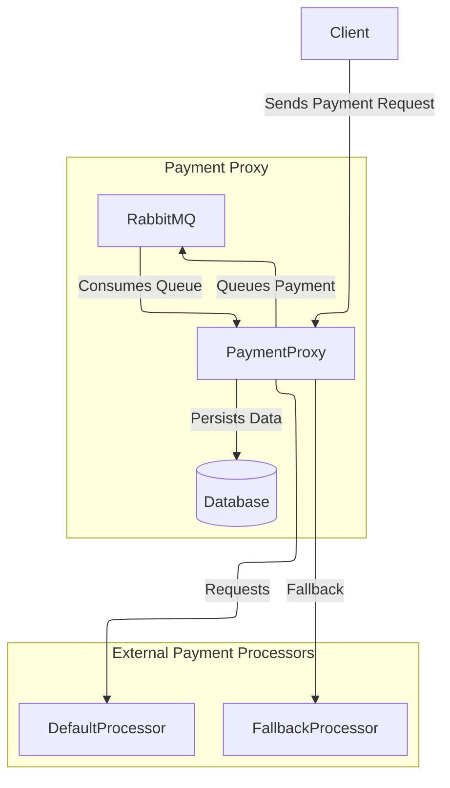

# Payment Proxy

This project implements a payment proxy that uses the payment processors of the [Rinha de Backend 2025](https://github.com/tsantanadev/rinha-de-backend-2025/tree/main).

```mermaid
---
config:
  layout: elk
---
graph TD
    subgraph Payment Proxy
        PaymentProxy
        RabbitMQ
        PostgresDB
    end

    subgraph External Payment Processors
        DefaultProcessor
        FallbackProcessor
    end

    Client -->|Sends Payment Request| PaymentProxy
    PaymentProxy -->|Queues Payment| RabbitMQ
    RabbitMQ -->|Consumes Queue| PaymentProxy
    PaymentProxy -->|Requests| DefaultProcessor
    PaymentProxy -->|Fallback| FallbackProcessor
    PaymentProxy -->|Persists Data| PostgresDB[(Database)]
```

